# Module 7 and 8

## 1. Try Test-Connection and nslookup commands for below websites
- www.google.com  
- www.facebook.com  
- www.amazon.com  
- www.github.com  
- www.cisco.com  

Answer 

```


1 .  ping -c 4 google.com
PING google.com (142.250.206.78) 56(84) bytes of data.
64 bytes from pnmaaa-ay-in-f14.1e100.net (142.250.206.78): icmp_seq=1 ttl=117 time=18.4 ms
64 bytes from pnmaaa-ay-in-f14.1e100.net (142.250.206.78): icmp_seq=2 ttl=117 time=18.1 ms
64 bytes from pnmaaa-ay-in-f14.1e100.net (142.250.206.78): icmp_seq=3 ttl=117 time=15.7 ms
64 bytes from pnmaaa-ay-in-f14.1e100.net (142.250.206.78): icmp_seq=4 ttl=117 time=17.2 ms

--- google.com ping statistics ---
4 packets transmitted, 4 received, 0% packet loss, time 3269ms
rtt min/avg/max/mdev = 15.655/17.326/18.386/1.061 ms
 
 ping -c 4 cisco.com
PING cisco.com (72.163.4.185) 56(84) bytes of data.
64 bytes from redirect-ns.cisco.com (72.163.4.185): icmp_seq=1 ttl=41 time=264 ms
64 bytes from redirect-ns.cisco.com (72.163.4.185): icmp_seq=2 ttl=41 time=261 ms
64 bytes from redirect-ns.cisco.com (72.163.4.185): icmp_seq=3 ttl=41 time=262 ms
64 bytes from redirect-ns.cisco.com (72.163.4.185): icmp_seq=4 ttl=41 time=261 ms

--- cisco.com ping statistics ---
4 packets transmitted, 4 received, 0% packet loss, time 3171ms
rtt min/avg/max/mdev = 261.000/261.895/263.685/1.064 ms


 ping -c 4 www.amazon.com
PING e15316.dsca.akamaiedge.net (23.41.122.94) 56(84) bytes of data.
64 bytes from a23-41-122-94.deploy.static.akamaitechnologies.com (23.41.122.94): icmp_seq=1 ttl=54 time=18.0 ms
64 bytes from a23-41-122-94.deploy.static.akamaitechnologies.com (23.41.122.94): icmp_seq=2 ttl=54 time=17.6 ms
64 bytes from a23-41-122-94.deploy.static.akamaitechnologies.com (23.41.122.94): icmp_seq=3 ttl=54 time=18.8 ms
64 bytes from a23-41-122-94.deploy.static.akamaitechnologies.com (23.41.122.94): icmp_seq=4 ttl=54 time=18.2 ms

--- e15316.dsca.akamaiedge.net ping statistics ---
4 packets transmitted, 4 received, 0% packet loss, time 3270ms
rtt min/avg/max/mdev = 17.642/18.160/18.789/0.415 ms


 ping -c 4 www.facebook.com
PING star-mini.c10r.facebook.com (57.144.208.1) 56(84) bytes of data.
64 bytes from edge-star-mini-shv-01-maa3.facebook.com (57.144.208.1): icmp_seq=1 ttl=55 time=17.5 ms
64 bytes from edge-star-mini-shv-01-maa3.facebook.com (57.144.208.1): icmp_seq=2 ttl=55 time=20.3 ms
64 bytes from edge-star-mini-shv-01-maa3.facebook.com (57.144.208.1): icmp_seq=3 ttl=55 time=18.6 ms
64 bytes from edge-star-mini-shv-01-maa3.facebook.com (57.144.208.1): icmp_seq=4 ttl=55 time=15.7 ms

--- star-mini.c10r.facebook.com ping statistics ---
4 packets transmitted, 4 received, 0% packet loss, time 3269ms
rtt min/avg/max/mdev = 15.713/18.037/20.313/1.667 ms


 nslookup www.google.com
Server:         10.255.255.254
Address:        10.255.255.254#53

Non-authoritative answer:
Name:   www.google.com
Address: 142.251.152.119


nslookup www.amazon.com
Server:         10.255.255.254
Address:        10.255.255.254#53

Non-authoritative answer:
www.amazon.com  canonical name = tp.47cf2c8c9-frontier.amazon.com.
tp.47cf2c8c9-frontier.amazon.com        canonical name = cf.47cf2c8c9-frontier.amazon.com.
Name:   cf.47cf2c8c9-frontier.amazon.com
Address: 108.159.19.102


nslookup www.cisco.com
Server:         10.255.255.254
Address:        10.255.255.254#53

Non-authoritative answer:
www.cisco.com   canonical name = www.cisco.com.akadns.net.
www.cisco.com.akadns.net        canonical name = wwwds.cisco.com.edgekey.net.
wwwds.cisco.com.edgekey.net     canonical name = wwwds.cisco.com.edgekey.net.globalredir.akadns.net.
wwwds.cisco.com.edgekey.net.globalredir.akadns.net      canonical name = e2867.dsca.akamaiedge.net.
Name:   e2867.dsca.akamaiedge.net
Address: 23.41.120.121


nslookup www.github.com
Server:         10.255.255.254
Address:        10.255.255.254#53

Non-authoritative answer:
www.github.com  canonical name = github.com.
Name:   github.com
Address: 20.207.73.82

```

---

## 2. Use Wireshark to capture and analyze DNS, TCP, UDP traffic and packet header, packet flow, options and flags


### 1. TCP
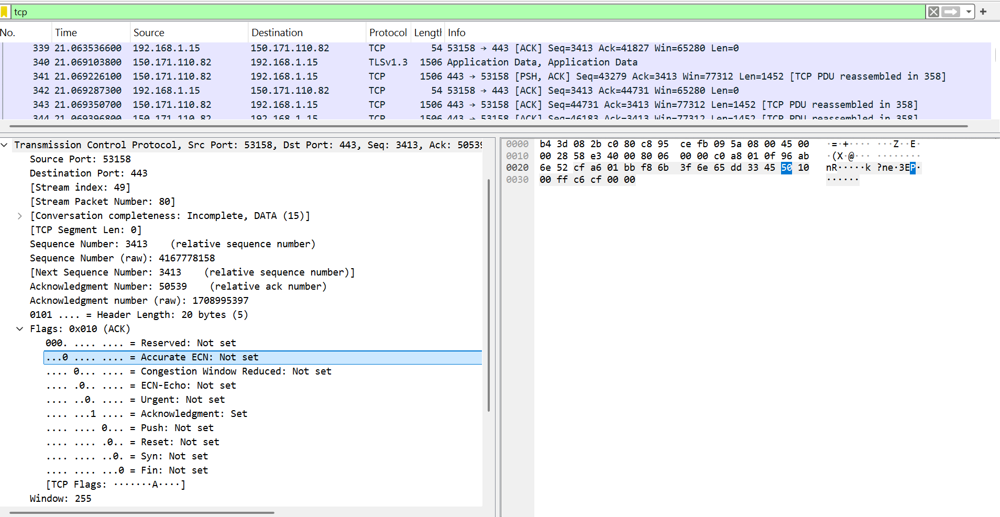

### 2. UDP packets 
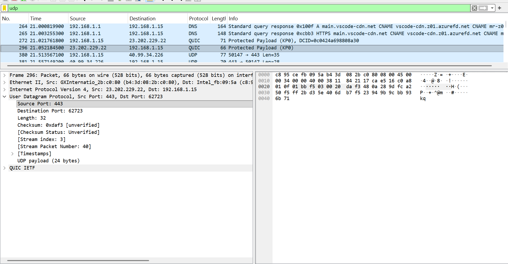

### 3. DNS packets
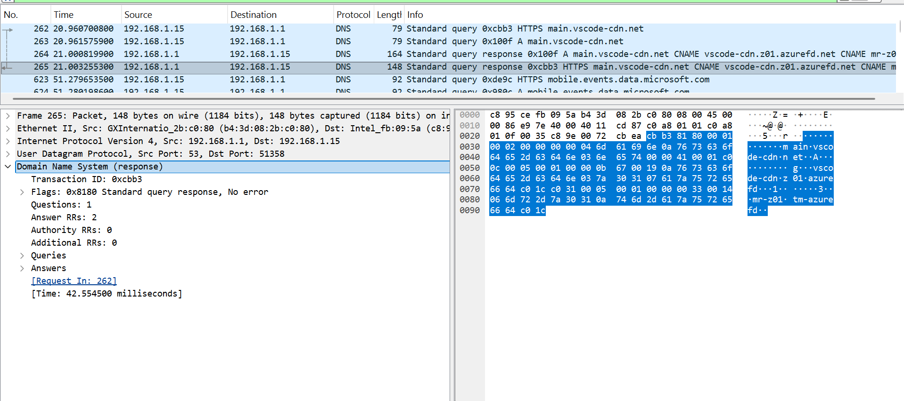

---

## 3. Explore traceroute/tracert for different websites (e.g., google.com) and analyse the parameters in the output and explore different options for traceroute command

Answer 

```
3. traceroute google.com
traceroute to google.com (142.251.43.238), 64 hops max
  1   172.29.0.1  0.470ms  0.228ms  0.228ms
  2   192.168.0.1  3.409ms  1.738ms  11.395ms
  3   *  *  *
  4   10.200.150.67  1666.448ms !X  1447.445ms !X  1553.357ms !X
```

### Options in traceroute used commonly:
The traceroute command accepts several options to customize its behavior:

```
-n — Do not resolve IP addresses to hostnames. This speeds up the output by skipping DNS lookups.

-m max_ttl — Set the maximum number of hops (default is 30).

-q nqueries — Set the number of probe packets per hop (default is 3).

-w waittime — Set the time in seconds to wait for a response (default is 5).

-I — Use ICMP ECHO packets instead of UDP (requires root privileges).

-T — Use TCP SYN packets instead of UDP (requires root privileges).

-p port — Set the destination port for UDP or TCP probes.

-s source_addr — Use the specified source IP address.

-i interface — Send packets through the specified network interface.
```
---

## 4. Use Cisco Packet Tracer for the below

---

## 5. Set up trunk ports between switches and try ping between different VLANs


### Step 1: Use Devices
1 Router
1 Switch
4 PCs
### Step 2: Create VLANs on Switch
```
enable
configure terminal

vlan 10
vlan 20
vlan 30
vlan 40
```

### Step 3: Assign Ports to VLANs

Example:
```
interface fa0/1
switchport mode access
switchport access vlan 10

interface fa0/2
switchport mode access
switchport access vlan 20

interface fa0/3
switchport mode access
switchport access vlan 30

interface fa0/4
switchport mode access
switchport access vlan 40
```

### Step 4: Configure Trunk Port (Switch → Router)

```
interface fa0/24
switchport mode trunk
```


### Step 5: Configure Router Subinterfaces
```
enable
configure terminal

interface g0/0
no shutdown

interface g0/0.10
encapsulation dot1Q 10
ip address 10.0.0.1 255.255.255.192

interface g0/0.20
encapsulation dot1Q 20
ip address 10.0.0.65 255.255.255.192

interface g0/0.30
encapsulation dot1Q 30
ip address 10.0.0.129 255.255.255.192

interface g0/0.40
encapsulation dot1Q 40
ip address 10.0.0.193 255.255.255.192
```


### Step 6: Assign IPs to PCs
| VLAN | Subnet	| PC IP	| Gateway |
|-------|-------|-------|---------|
|10	 | 10.0.0.0/26 | 10.0.0.2 |	10.0.0.1 |
|20	 | 10.0.0.64/26	| 10.0.0.66 | 10.0.0.65 |
|30	 | 10.0.0.128/26 | 10.0.0.130 | 10.0.0.129 |
|40  | 10.0.0.192/26 | 10.0.0.194 | 10.0.0.193 |
------------------------------------------

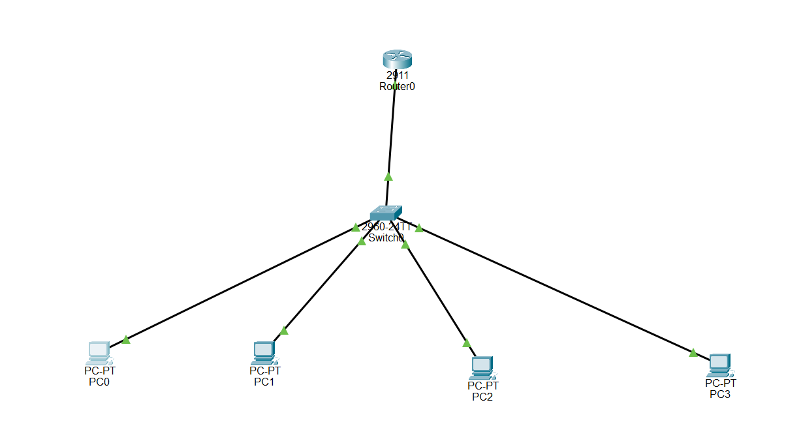

### Step 7: Test Connectivity

From any PC:
```
ping 10.0.0.66
ping 10.0.0.130
ping 10.0.0.194
```

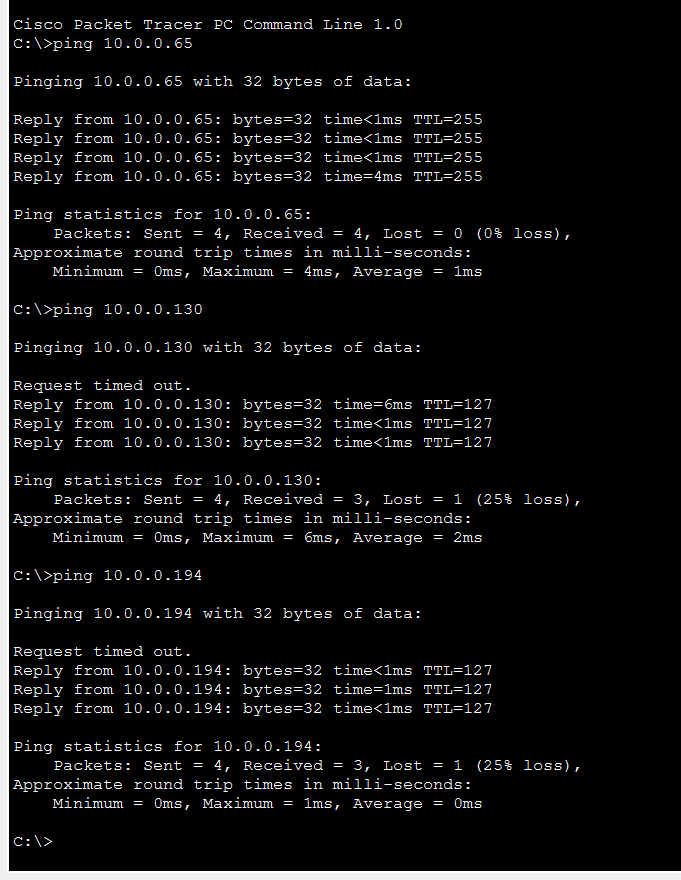

---

## 6. Change the native VLAN on a trunk port. Test for VLAN mismatches and troubleshoot

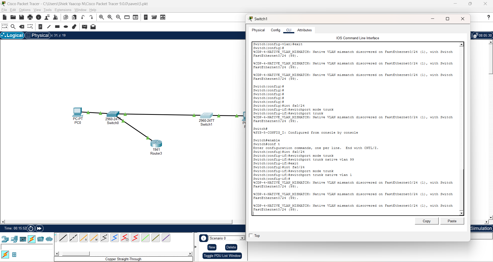
---

## 7. Configure a management VLAN and assign an IP address for remote access. Test SSH or Telnet access to the switch

```
7.  Create management vlan

Switch> enable
Switch# configure terminal
Switch(config)# vlan 99
Switch(config-vlan)# name MANAGEMENT
Switch(config-vlan)# exit


assign ip address to vlan 99

Switch(config)# interface vlan 99
Switch(config-if)# ip address 192.168.99.1 255.255.255.0
Switch(config-if)# no shutdown
Switch(config-if)# exit

assign switch port to vlan 99

Switch(config)# interface fastEthernet 0/1
Switch(config-if)# switchport mode access
Switch(config-if)# switchport access vlan 99
Switch(config-if)# exit

set default gateway

Switch(config)# ip default-gateway 192.168.99.254

enable telnet access

Switch(config)# line vty 0 4
Switch(config-line)# password cisco
Switch(config-line)# login
Switch(config-line)# transport input telnet
Switch(config-line)# exit

enable ssh access

Switch(config)# hostname Switch1
Switch1(config)# ip domain-name lab.local
Switch1(config)# crypto key generate rsa
  → Enter key size: 1024

Switch1(config)# username admin privilege 15 secret cisco123
Switch1(config)# line vty 0 4
Switch1(config-line)# transport input ssh
Switch1(config-line)# login local
Switch1(config-line)# exit

Switch1(config)# ip ssh version 2


PC Configuration

Set the PC's IP in the same subnet:
- **IP:** `192.168.99.10`
- **Subnet:** `255.255.255.0`
- **Gateway:** `192.168.99.254`


Testing

Telnet Test — Open PC Command Prompt:
telnet 192.168.99.1

SSH Test:
ssh -l admin 192.168.99.1
```

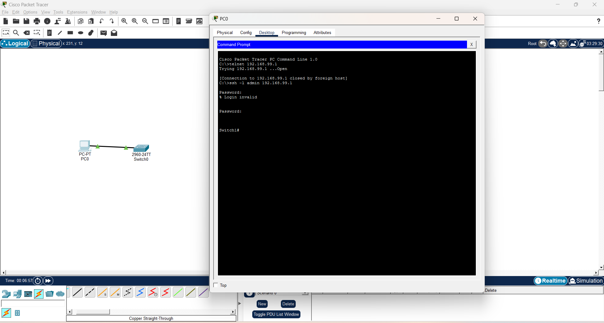

---

## 8. You have a Cisco switch and a VoIP phone that needs to be placed in a voice VLAN (VLAN 20). The data for the PC should remain in a separate VLAN (VLAN 10). Configure the switch port to support both voice and data traffic

---

## 9. You configured VLANs 10 and 20 on your switch and assigned ports to each VLAN. However, devices in VLAN 10 cannot communicate with devices in VLAN 20. Troubleshoot the issue

```
9. SWITCH CONFIG
Switch(config)# vlan 10
Switch(config-vlan)# name DATA
Switch(config)# vlan 20
Switch(config-vlan)# name SALES

Switch(config)# interface range fa0/1-2
Switch(config-if-range)# switchport mode access
Switch(config-if-range)# switchport access vlan 10

Switch(config)# interface range fa0/3-4
Switch(config-if-range)# switchport mode access
Switch(config-if-range)# switchport access vlan 20

Switch(config)# interface fa0/24
Switch(config-if)# switchport mode trunk
Switch(config-if)# switchport trunk allowed vlan 10,20

ROUTER 1941 CONFIG
Router(config)# interface GigabitEthernet 0/0
Router(config-if)# no shutdown

Router(config)# interface GigabitEthernet 0/0.10
Router(config-subif)# encapsulation dot1Q 10
Router(config-subif)# ip address 192.168.10.1 255.255.255.0
Router(config-subif)# no shutdown

Router(config)# interface GigabitEthernet 0/0.20
Router(config-subif)# encapsulation dot1Q 20
Router(config-subif)# ip address 192.168.20.1 255.255.255.0
Router(config-subif)# no shutdown
```

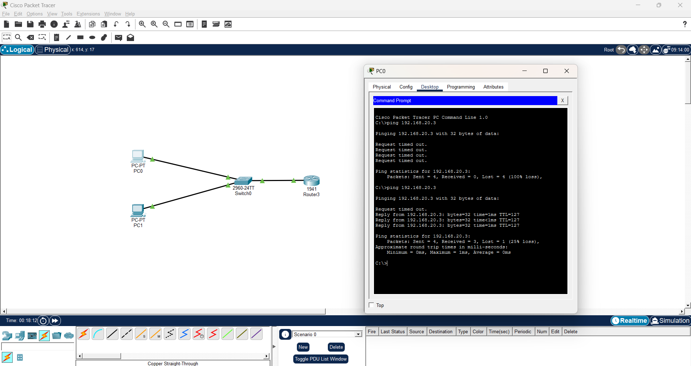
---

## 10. Try Inter VLAN routing with Router

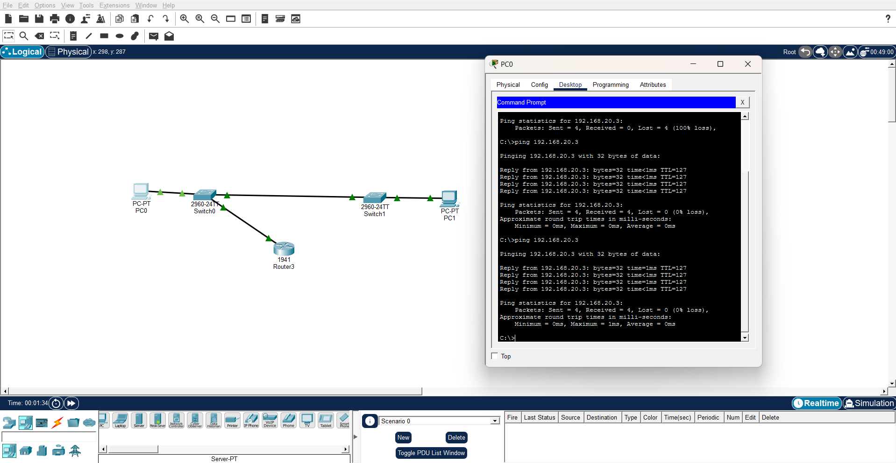
---

## 11. Implement ACLs to restrict traffic based on source and destination ports. Test rules by simulating legitimate and unauthorized traffic

```
Switch(config)# vlan 10
Switch(config-vlan)# name DATA
Switch(config)# vlan 20
Switch(config-vlan)# name SALES

Switch(config)# interface range fa0/1-2
Switch(config-if-range)# switchport mode access
Switch(config-if-range)# switchport access vlan 10

Switch(config)# interface range fa0/3-4
Switch(config-if-range)# switchport mode access
Switch(config-if-range)# switchport access vlan 20

Switch(config)# interface fa0/24
Switch(config-if)# switchport mode trunk
Switch(config-if)# switchport trunk allowed vlan 10,20

ROUTER 1941 CONFIG
Router(config)# interface GigabitEthernet 0/0
Router(config-if)# no shutdown

Router(config)# interface GigabitEthernet 0/0.10
Router(config-subif)# encapsulation dot1Q 10
Router(config-subif)# ip address 192.168.10.1 255.255.255.0
Router(config-subif)# no shutdown

Router(config)# interface GigabitEthernet 0/0.20
Router(config-subif)# encapsulation dot1Q 20
Router(config-subif)# ip address 192.168.20.1 255.255.255.0
Router(config-subif)# no shutdown


Router> enable
Router# configure terminal

! Create Extended ACL number 100
Router(config)# ip access-list extended RESTRICT_TRAFFIC

Router(config-ext-nacl)# permit tcp 192.168.10.0 0.0.0.255 192.168.20.0 0.0.0.255 eq 80
Router(config-ext-nacl)# permit tcp 192.168.10.0 0.0.0.255 192.168.20.0 0.0.0.255 eq 21
Router(config-ext-nacl)# deny tcp 192.168.10.0 0.0.0.255 192.168.20.0 0.0.0.255 eq 23
```

---

## 12. Configure a standard Access Control List (ACL) on a router to permit traffic from a specific IP range. Test connectivity to verify the ACL is working as intended

Answer 

## Configure Standard ACL on Router and Verify Connectivity (Cisco Packet Tracer)

### 1. Topology Setup
- Add:
  - 1 Router
  - 1 Switch
  - 2–3 PCs
- Connect all PCs to switch
- Connect switch -> router

---

### 2. Assign IP Addresses

#### Router
- interface fa0/0
- ip address 192.168.1.1 255.255.255.0
- no shutdown

#### PCs
- PC0 -> 192.168.1.10
- PC1 -> 192.168.1.20
- PC2 -> 192.168.1.30
- Subnet -> 255.255.255.0
- Gateway -> 192.168.1.1

---

### 3. Verify Normal Connectivity
- From PCs:
  - ping 192.168.1.1
- Ensure all PCs can reach router

### 4. Create Standard ACL

#### Example: Permit only 192.168.1.0/24 (or specific range)

- enable
- configure terminal
- access-list 1 permit 192.168.1.0 0.0.0.255

#### Example: Permit only one PC
- access-list 1 permit 192.168.1.10 0.0.0.0


### 5. Apply ACL to Interface
- interface fa0/0
- ip access-group 1 in

### 6. Test Connectivity

#### Allowed PC
- ping 192.168.1.1
- Result:
  - Success

#### Blocked PC
- ping 192.168.1.1
- Result:
  - Request timed out

### 7. Verify ACL
- show access-lists
- show running-config

### 8. Key Observations
- Standard ACL filters based only on source IP
- Applied closest to destination
- Implicit deny at end blocks all other traffic

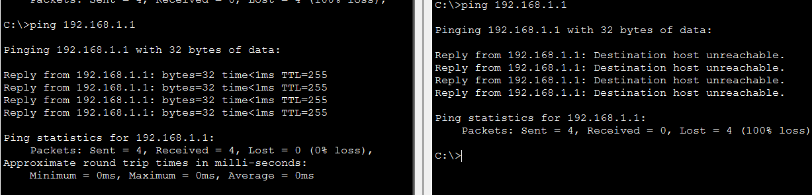

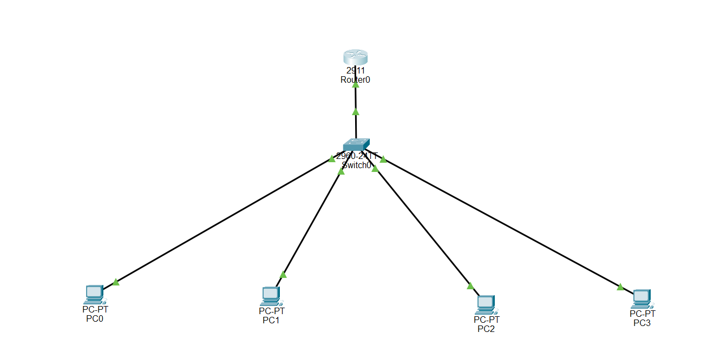 


## 13. Create an extended ACL to block specific applications, such as HTTP or FTP traffic. Test the ACL rules by attempting to access blocked services

---

## 14. Try Static NAT, Dynamic NAT and PAT to translate IPs

---

## 15. Download iperf in laptop/phone and make sure they are in same network. Try different iperf commands with TCP, UDP, bidirectional, reverse, multicast, parallel options and analyze the bandwidth and rate of transmission, delay, jitter etc.